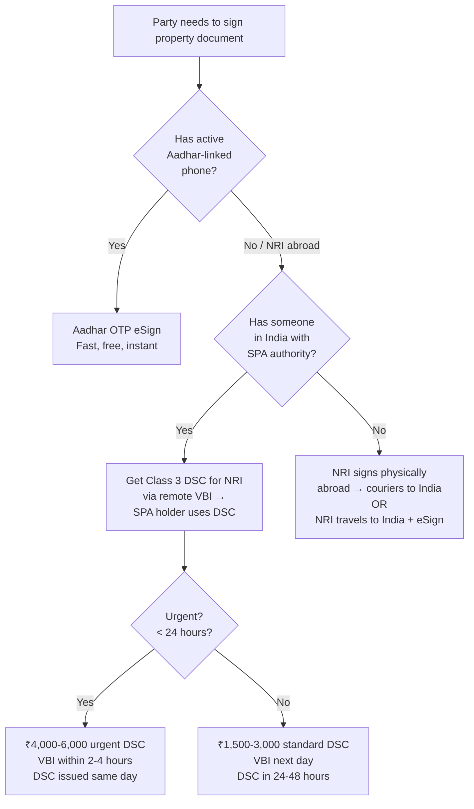

# eSign / DSC for NRI Property Document Execution

**When to use this:** A DRAAS property document (sale deed, sharing agreement, SPA) needs to be executed where one or more parties are NRIs/OCIs located abroad. Covers Aadhar eSign limitations, Class 3 DSC remote issuance for NRIs, and hybrid signing accepted by sub-registrars.

---

## The Two Digital Signature Methods (India)

| Method | Auth Mechanism | Tied To | Representative Capacity? | Works for NRI/OCI? |
|--------|---------------|---------|------------------------|---------------------|
| **Aadhar OTP eSign** | UIDAI — OTP sent to Aadhar-linked mobile | **The Aadhar holder personally** | ❌ No — signature cert shows only the Aadhar holder's name | Only if Aadhar-linked mobile is active |
| **Class 3 DSC** (Digital Signature Certificate) | Cryptographic key (.pfx file) | **The certificate owner** — can be used by anyone with the .pfx password | ✅ Yes — signing party states "under SPA" | ✅ Yes — remote issuance via VBI |

### Critical rule: Aadhar OTP eSign is personal

- When Raghu enters his Aadhar number → UIDAI sends OTP to **his** registered mobile → he enters OTP → the digital signature is cryptographically tied to **Raghu's Aadhar number**
- There is **no "representative capacity" or "SPA holder" mode** in the CCA eSign API
- When the document is verified, the signature certificate says **Raghu's name and Aadhar** — even if trying to sign on Faridah's behalf
- **Result at sub-registrar:** Two identical Aadhar-based signatures, both showing Raghu as signer, claiming to represent two different people — likely rejected
- **Law:** CCA eSign Guidelines — eSign authentication is **personal to the Aadhar holder** — no representative signing provision

### Legal framework

- **SPA Act 1882** + **Registration Act 1908** — a registered/adjudicated SPA is fully valid for executing property documents, including digitally
- **IT Act 2000, Section 5** — eSign is valid as a digital signature
- **CCA eSign Guidelines** — eSign authentication is personal to the Aadhar holder
- **Karnataka Registration Practice** — sub-registrars routinely accept hybrid (physical + digital) signatures on the same document

---

## Class 3 DSC for NRI/OCI from Abroad — Remote Issuance

All major Indian CCA-licensed CAs support **fully remote Video-Based Identification (VBI)** for NRI/OCI applicants. The applicant never needs to visit any office.

### Certified Authorities that support NRI remote DSC

| CA | Website | Notes |
|----|---------|-------|
| **eMudhra** | emudhra.com | Largest CCA-licensed CA; NRI-friendly. Buy DSC → Class 3 Individual (Signing) |
| **Sify Technologies** | sifytechnologies.com | "NRI DSC" section on site; same VBI process |
| **Capricorn** | capricorn.co.in | CCA-licensed, supports NRI via VBI |
| **NSDL e-Gov** | nsdl.co.in | Partners with eMudhra for issuance |

### Documents required

- ✅ **OCI Card** (both sides)
- ✅ **Passport** (current — same one used for any prior SPA/GPA)
- ✅ **Proof of residence** in the country of residence (utility bill, bank statement, lease — any one)
- ✅ **Passport-size photo** (white background, smartphone photo accepted)
- ✅ **Local mobile number** (Australian mobile, etc. — for OTP verification during the process)
- ✅ **Email address**

### Step-by-step process

**Step 1 — Apply online**
- Visit the CA's website and select **Class 3 Individual DSC (Signing only)** — no encryption needed, cheaper and faster
- Cost: ₹1,500–₹3,000 standard; **₹4,000–₹6,000 for urgent/same-day**
- Select "urgent / expedited" if available

**Step 2 — Upload documents**
- Scan/photograph all documents listed above
- Upload via the CA's portal

**Step 3 — Payment**
- Pay online — most CAs accept Visa/MasterCard international transactions
- If the NRI's card fails, someone in India can pay on their behalf

**Step 4 — Video Verification (VBI) — 5–10 minute call**
- Applicant receives a link for a **video call** (WhatsApp, Zoom, or the CA's own app)
- A CA representative calls at a scheduled time (immediate if same-day priority)
- On the call:
  - Applicant shows **original documents** (passport + OCI card) **next to their face**
  - Confirms **verbally**: name, date of birth, OCI/passport number, purpose of DSC application
  - States intent to obtain a Class 3 DSC
- The CA rep records the entire call — this becomes the legally valid audit trail

**⚠️ Timezone consideration:**
- Indian CAs operate VBI during **9 AM – 6 PM IST**
- Australian Eastern (AEST): 1:30 PM – 10:30 PM — fits the applicant's afternoon/evening
- Australian Western (AWST): 11:00 AM – 8:00 PM
- US (EST): 11:30 PM – 8:30 AM (previous day) — early morning
- UK: 4:30 AM – 1:30 PM — early morning
- **For Australia, an afternoon video call works well within Indian business hours**

**Step 5 — DSC issuance (after successful VBI)**
- Issued within **30 minutes to 2 hours** (same-day/urgent)
- Email sent with:
  - Download link for the `.pfx` (or `.p12`) file
  - Password for the file
- Install the DSC using the CA's installer tool (simple one-click setup)

**Step 6 — Signing the document**

Two options:

**Option A — NRI signs it themselves:**
- Opens document on CA's signing portal or desktop tool (eMudhra DigiSigner, etc.)
- Enters DSC password
- Downloads signed PDF and sends to India

**Option B — Export DSC to India (faster, common in practice):**
- NRI exports the `.pfx` file from their system
- Emails the `.pfx` file + the password to the authorized person in India (e.g., SPA holder)
- Authorized person installs DSC on their system and signs "for and on behalf of [NRI] under SPA dated [X]"
- **Legally valid because:** (a) SPA already authorizes the person to act, and (b) DSC usage tracks to the certificate owner's identity

### DSC cost summary

| Category | Price (₹) |
|----------|-----------|
| Standard Class 3 DSC (24–48 hr) | 1,500 – 3,000 |
| Urgent/Same-day Class 3 DSC (2–4 hr) | 4,000 – 6,000 |

---

## Recommended: Hybrid Signing for Documents with NRI Parties

When one party can eSign (Aadhar OTP active) and the other is an NRI:

| Party | Method | How |
|-------|--------|-----|
| **Party with active Aadhar + phone** | Aadhar OTP eSign | Signs once in their personal capacity |
| **NRI party via SPA** | Class 3 DSC (used by SPA holder) | SPA holder signs "under SPA dated [X]" |
| **Alternative: NRI signs physically** | Physical wet signature abroad | Couriers/hand-carries signed page |
| **Alternative: SPA holder signs physically** | Physical signature "under SPA" | Sub-registrar accepts routinely if SPA is adjudicated |

### Document presentation at sub-registrar

The document listed as:
> **Party 1:** [Name] (signing personally)
> **Party 2:** [NRI Name], represented by their SPA holder [SPA Holder Name]

Then:
1. Party 1 → eSign once with Aadhar OTP ✅
2. Party 2 → Signed by SPA holder using NRI's DSC (or physically "under SPA") ✅

### Sub-registrar requirements

Bring these originals/copies:
- ✅ Original SPA (or GPA) — notarised/adjudicated
- ✅ Adjudication order from District Registrar
- ✅ Any existing registered GPA/JDA
- ✅ Both parties' OCI cards & passports
- ✅ NRI's Aadhar card (even if phone is deactivated — still valid identity proof)
- ✅ DSC certificate copy + signing screen recording (optional but recommended)

### What does NOT work

| Scenario | Why it fails |
|----------|-------------|
| Raghu uses his Aadhar to eSign on Faridah's behalf | eSign requires the **Aadhar holder's own OTP/biometric** — cert shows Raghu's identity, not Faridah's |
| Faridah uses Aadhar biometric from abroad | Requires a physical biometric scanner; not available remotely |
| Two identical Aadhar eSigns for two different people | Sub-registrar flags duplicate signatures representing different parties |

---

## Practical Decision Tree

